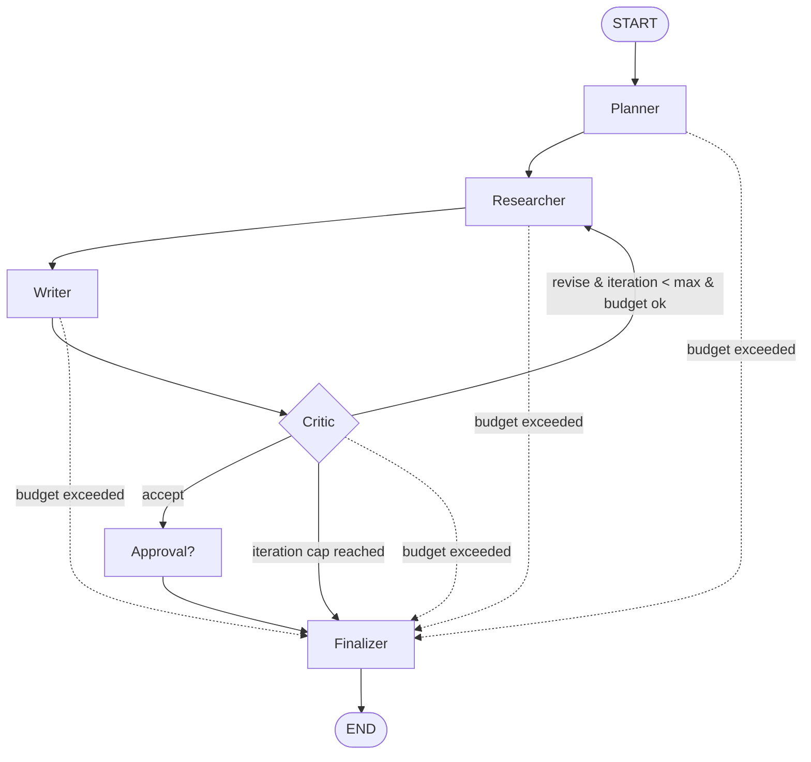

# Architecture

A deep dive into how the Agentic Research & Report Assistant is built and why.
For a quickstart and results, see the [README](README.md).

## 1. Core concepts

This project is a small but complete example of several agentic-AI patterns:

- **Orchestration** — a directed graph of nodes with shared, typed state and
  explicit edges (LangGraph). Loops, branches, and a human gate are first-class.
- **Multi-agent roles** — the work is split across narrow agents (planner,
  researcher, writer, critic) rather than one monolithic prompt. Each role is
  small, independently testable, and easy to reason about.
- **Tool use** — agents gather evidence through `search` and `fetch` tools that
  sit behind interfaces, so the same agent code runs against a local corpus
  (keyless) or the real web.
- **Guardrails** — schema validation with retry, a hard citation guarantee, a
  token/cost budget, and an iteration cap. The system fails safe, never hangs,
  and never invents sources.
- **Reflection loop** — the critic verifies the draft and can send the graph back
  through a revise pass (the researcher covers any not-yet-attempted facet, the
  writer re-drafts without the rejected claims), the "verify-then-revise" pattern
  that measurably reduces unsupported claims (see the A/B in the README).
- **Evaluation** — a golden set + metrics + an A/B + a CI gate, so quality is a
  number that can regress a build, not a vibe.

## 2. The keyless principle (most important design choice)

Every external dependency (LLM, search, fetch) is defined as a `typing.Protocol`
with two implementations:

- a **real** one (`OpenAILLM`, `OpenWebSearch`, `HttpFetch`) whose heavy SDK is
  imported *lazily inside the method*, and
- a deterministic **fake** (`FakeLLM`, `FakeSearch`, `FakeFetch`).

A `get_*(settings)` factory returns one based on typed config. Defaults are
fake/offline, so the whole system — graph, tools, API, tests, CI — runs with **no
API key and zero cost**, and produces identical output for identical input. This
is what makes the test suite fast and deterministic and the CI free of secrets.

The "intelligence" of keyless mode lives in `FakeLLM`, which is **rule-based per
role**: the planner derives sub-questions from the question, the writer composes
claims *only* from supplied evidence and cites real ids, and the critic flags any
claim whose cited evidence does not support it. Because the rules are
deterministic, the agents, the eval, and the tests all agree on what "relevant"
and "supported" mean (all routed through `textutil.py`).

## 3. State schema

The graph threads a single typed state (`GraphState`, a `TypedDict`) whose values
are the pydantic models in `schemas.py`:

| field | type | role |
|---|---|---|
| `question` | `str` | the user's research question (clamped on input) |
| `plan` | `ResearchPlan \| None` | planner output: sub-questions + search queries |
| `evidence` | `list[Evidence]` | gathered snippets, each with a stable `id` + real source |
| `draft` | `Report \| None` | the writer's current report |
| `critique` | `Critique \| None` | supported/unsupported claim ids + verdict |
| `iteration` | `int` | number of revise loops taken (vs `max_iterations`) |
| `budget` | `Budget` | token limit / tokens used / usd used |
| `rejected` | `list[str]` | claim texts the critic removed (so the writer won't re-add them) |
| `tool_calls` | `int` | running count of search + fetch calls |
| `researched_sqs` | `list[str]` | sub-question ids already attempted (a revise loop never re-searches a facet) |
| `next_action` | `str` | the critic's routing decision: `revise` or `finalize` |
| `unresolved` | `bool` | a revise was warranted but the cap/budget prevented it (→ `partial`) |
| `trace` | `Annotated[list[Step], +]` | the ordered execution trace (reducer concatenates) |
| `status` / `final` | `str` / `Report` | final status and report |

Only `trace` uses a reducer (steps from every node are concatenated). All other
keys are overwritten by the node that returns them; because the graph runs one
node at a time, this is unambiguous.

`Evidence.id` is the anchor of the whole correctness story: the writer may only
cite ids that exist in `evidence`, and the finalizer maps each cited id to a
numbered `Citation`.

## 4. The graph

Edges are **conditional functions** built in `build_graph(ctx)`:

- After every working node a **budget guard** runs: if `budget.exceeded`, route
  straight to the finalizer (which marks the run `partial`). This is why a tiny
  `token_budget` ends cleanly instead of hanging. Because a call's token cost is
  only known *after* it runs, the guard sits on each edge (and the researcher also
  checks before every tool call); a run may overshoot by at most one node, then
  exits cleanly — it never hangs. One exception: once a draft exists, a required
  human-approval gate is never bypassed — a budget-exhausted run still passes
  through approval before the finalizer.
- After the **critic**: `revise` + under both the iteration cap and budget →
  back to the researcher; otherwise → approval (if enabled) → finalizer.
- If `enable_critic=False`, the writer routes directly past the critic — this is
  exactly the "critic OFF" arm of the A/B.

Nodes are pure functions `(state, ctx) -> dict`; the context (providers, tracer,
settings, approval callback) is injected via `functools.partial`, keeping nodes
free of globals and trivial to unit-test.

### Termination & convergence

The deliberately-unsupported synthesis claim forces exactly one revise: the
critic removes it and records its text in `rejected`; on the next pass the writer
regenerates but filters out anything in `rejected`, so the draft converges and
the critic accepts.

The critic owns the loop decision. It revises only when that is both **warranted**
(a claim was actually unsupported) and **permitted** (under `max_iterations` and
the token budget), recording the outcome in `next_action`. If a revise is
warranted but not permitted it sets `unresolved`, which the finalizer turns into a
`partial` status. Consequently `max_iterations=1` runs one loop and then
*completes*, while `max_iterations=0` returns a cleaned-but-`partial` report — and
a (real) critic that asks to revise without naming any unsupported claim simply
does not loop. `max_iterations` and the budget are hard upper bounds, and a
`recursion_limit` on the compiled graph is a final backstop.

## 5. The no-fabricated-sources guarantee

Two independent layers protect source integrity:

1. **`enforce_citations(report, evidence)`** (in `guardrails.py`) runs
   unconditionally in the finalizer. It strips any citation to an id not present
   in `evidence` and drops a claim whose every citation was invalid. This makes
   it *structurally impossible* for the final report to cite an ungathered
   source — regardless of what the model produced. Proven by
   `tests/test_guardrails.py::test_enforce_citations_drops_fabricated_source`.
2. **The critic** additionally removes *uncited* or *weakly-supported* claims
   (content mismatch between claim and cited snippet).

Because layer 1 is always on, `source_validity` is `1.0` in both arms of the
critic A/B; the critic's measurable contribution shows up in `citation_coverage`
and `support_rate`.

## 6. Observability

`Tracer.span(node, tool)` is a context manager that times a step; the node fills
in tokens / usd / summaries and emits a `Step`. After the run, `persist_run`
writes `runs/<run_id>.json` (full) and appends a one-line summary to
`runs/index.jsonl` under a `threading.Lock`. `aggregate()` reads the index,
**tolerates a torn final line**, and computes runs, avg cost/latency/steps,
average citation coverage, and a **nearest-rank p95** latency
(`ceil(0.95·n)-1`, clamped). The `Step` shape mirrors a Langfuse/OpenTelemetry
span so this layer can be swapped for a hosted backend without touching agents.

Cost comes from a small price table (`PRICES`, USD per 1K tokens); the fake model
is `$0`, which is why keyless runs honestly report zero cost. The costing
function is unit-tested with real model prices.

## 7. Evaluation

`eval/run_eval.py` runs every golden task on the keyless path and computes:

- `citation_coverage` — % of claims with ≥1 citation.
- `source_validity` — % of citations whose id was actually gathered (≈1.0; catches fabrication).
- `support_rate` — % of claims whose cited evidence supports them (keyword overlap).
- `point_coverage` — % of each task's `expected_points` present in the report (keyword proxy).
- `abstention_accuracy` — out-of-corpus tasks must produce no claims.
- run economics — avg tool calls / tokens / steps / latency.
- `faithfulness` — LLM-as-judge, **import-guarded**, `n/a` unless real mode.

Modes: default (writes `eval/results/metrics.{json,md}`), `--compare` (critic
ON/OFF A/B → `compare.{json,md}`), and `--min-citation-coverage X` (a CI gate that
exits non-zero on regression). Numbers are always recomputed from real runs —
none are hard-coded.

## 8. File-by-file walkthrough

- **`config.py`** — `Settings(BaseSettings)` + `get_settings()`; paths anchored at the repo root so corpus/runs lookups are CWD-independent; cross-field validation rejects provider mixes that cannot work together.
- **`context.py`** — `AgentContext`, the injected dependency bundle (providers, tracer, settings, approval callback) every node receives.
- **`schemas.py`** — every cross-boundary record as a pydantic model.
- **`textutil.py`** — tokenisation, overlap (overlap-coefficient), sentence splitting, markdown stripping, token estimate. The shared notion of "relevant".
- **`llm.py`** — `LLM` Protocol; `FakeLLM` (planner/writer/critic rules); `OpenAILLM` (lazy, JSON mode); `get_llm`.
- **`tools/search.py` / `tools/fetch.py`** — Protocols + fakes (corpus / `local://`) + real (Tavily / httpx) + factories with optional LRU caching.
- **`cache.py`** — `LRUCache` (lock + `OrderedDict`) and `CachedSearch`/`CachedFetch` wrappers that surface hit/miss counts.
- **`agents/*.py`** — the four nodes; `_common.py` holds the parsers and the `structured_call` validate/retry helper.
- **`guardrails.py`** — `clamp_input`, `enforce_citations`, `build_sources`, budget/iteration helpers, `validate_and_retry`.
- **`graph.py`** — `GraphState`, the approval/finalizer nodes, the conditional routers, and `build_graph`.
- **`observability.py`** — `Tracer`, cost table, persistence, `aggregate`.
- **`runner.py`** — `run()` (the one entry point), `render_report_markdown`, and the CLI.
- **`api.py`** — FastAPI service with validated request models and clean 500s. `POST /research` accepts optional `max_iterations`, `token_budget`, `require_approval`, and `enable_critic` overrides.
- **`ui/streamlit_app.py`** — a thin HTTP client (no business logic): example-question chips, colour-coded metric cards, a live critic on/off toggle, tabbed results (report / evidence / timeline / raw JSON) with downloads, and a sidebar observability panel fed by `GET /metrics`. Base theme in `.streamlit/config.toml`; screenshots in `docs/screenshots/`.

## 9. The DSPy optimization track (optional)

An opt-in backend (`agent_backend="dspy"`) re-implements the three LLM reasoning
steps as declarative DSPy modules whose prompts/demos can be **optimized against the
project's own metric** — "programming, not prompting". It is isolated by design:
`import dspy` is lazy, the keyless default is untouched, and the DSPy backend
conforms to the same `LLM` Protocol so the graph and guardrails are unchanged.

- **Signatures + modules** (`dspy_modules.py`): typed `dspy.Signature`s —
  `PlanResearch` (question → subquestions), `WriteReport` (question, context →
  summary, sections), `CritiqueReport` (report, context → verdict,
  unsupported_claims) — wrapped as `dspy.ChainOfThought`. `DSPyLLM.generate`
  dispatches on the role and returns the **same content dicts** the manual backend
  does, so the parsers, `enforce_citations`, and the eval are reused verbatim.
- **The metric** (`dspy_metric.py`): reuses `agent.metrics` (shared with the eval),
  weighting source-validity (no fabricated citations) heaviest. It is the scalar the
  optimizer maximizes, so it targets exactly the quality the eval reports.
- **The optimizer** (`optimize.py`): builds `dspy.Example`s from the golden tasks
  (evidence gathered by the keyless manual pipeline), runs `BootstrapFewShot` /
  `MIPROv2` to `compile` the program, and `save`s it to `dspy_artifact_path`. The
  compiled program optimizes the **writer and critic** (the reasoning that produces
  the scored report); the planner module is used un-bootstrapped, matching the
  scoped objective. Note that DSPy's LM is configured via process-global state, so
  the DSPy backend is not intended for concurrent API serving.
- **Artifact load path**: at runtime `build_program` loads the compiled program if
  the artifact exists, so the optimized prompts/demos are used automatically.

Honesty: DSPy metrics require a real LLM and are labelled as real-LLM results,
separate from the keyless baseline; `tests/test_dspy.py` exercises the DSPy modules
keyless via `DummyLM` (no key) and re-asserts the no-fabricated-sources guarantee.

## 10. Glossary

- **Agent** — a node with a narrow responsibility that reads and updates shared state.
- **Tool** — an external capability (search, fetch) behind a Protocol.
- **Evidence** — a gathered snippet with a stable id and real source metadata.
- **Claim** — one assertion in the report, with the evidence ids that back it.
- **Critic / verifier** — the node that checks claims against evidence and triggers a revise loop.
- **Guardrail** — code that constrains inputs/outputs (citation enforcement, budget, caps).
- **Budget guard** — the pre-edge check that routes to the finalizer when the token budget is spent.
- **Keyless mode** — running entirely on deterministic fake providers, no API key, zero cost.
- **Reflection / revise loop** — drafting, verifying, and regenerating until claims are supported or a cap is hit.
- **p95 (nearest-rank)** — the 95th-percentile latency by the nearest-rank method, resilient to small/torn samples.
