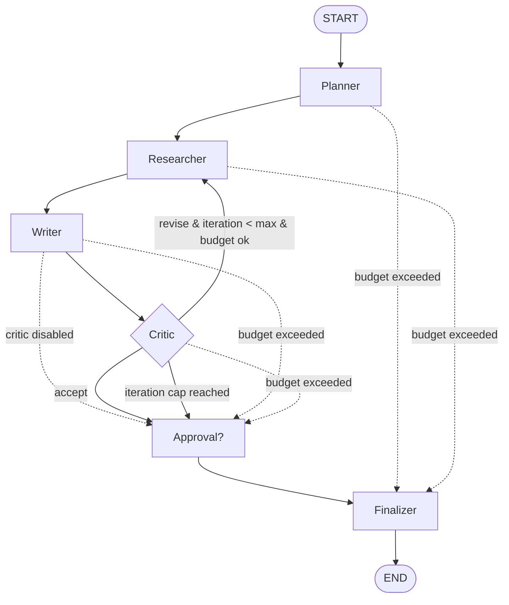

# Architecture

A deep dive into how the Agentic Research & Report Assistant is built and why.
For a quickstart and results, see the [README](README.md).

## 1. Core concepts

This project is a small but complete example of several agentic-AI patterns:

- **Orchestration** — a directed graph of nodes with shared, typed state and
  explicit edges (LangGraph). Loops, branches, and a human gate are first-class.
- **Multi-agent roles** — the work is split across narrow agents (planner,
  researcher, writer, critic) rather than one monolithic prompt. Each role is
  small, independently testable, and easy to reason about.
- **Tool use** — agents gather evidence through `search` and `fetch` tools that
  sit behind interfaces, so the same agent code runs against a local corpus
  (keyless) or the real web. The researcher fans these calls out **in parallel**
  across sub-questions (a thread pool over the I/O) and then replays the
  de-duplication and budget logic sequentially, so it is fast in real mode yet
  deterministic; `evidence_per_subquestion` sets report depth. In real mode each
  page's evidence is the passage that best answers the sub-question, ranked by
  meaning with an embedding model (`passages.py`); keyless runs pick by word overlap.
- **Guardrails** — schema validation with retry, a hard citation guarantee, a
  token/cost budget, and an iteration cap (in real mode both are a ceiling that
  requests can lower but not raise). The system fails safe, never hangs,
  and never invents sources.
- **Reflection loop** — the critic verifies the draft and can send the graph back
  through a revise pass in which the writer re-drafts from the same evidence without
  the rejected claims: the "verify-then-revise" pattern. Its removal mechanism is
  proven end to end; its quality effect with a real model measured ≈0 on this eval
  set (see the A/B in the README).
- **Evaluation** — a golden set + metrics + an A/B + a CI gate, so quality is a
  number that can regress a build, not a vibe.

## 2. The keyless principle (most important design choice)

Every external dependency (LLM, search, fetch) is defined as a `typing.Protocol`
with two implementations:

- a **real** one (`OpenAILLM`, `OpenWebSearch`, `HttpFetch`) whose heavy SDK is
  imported *lazily inside the method*, and
- a deterministic **fake** (`FakeLLM`, `FakeSearch`, `FakeFetch`).

The embedding model behind real mode's evidence ranking (`OpenAIEmbedder`) is the
one dependency without a fake: a keyless run simply has no embedder and picks
evidence by word overlap, exactly as before.

A `get_*(settings)` factory returns one based on typed config. Defaults are
fake/offline, so the whole system — graph, tools, API, tests, CI — runs with **no
API key and zero cost**, and produces identical output for identical input. This
is what makes the test suite fast and deterministic and the CI free of secrets.

The "intelligence" of keyless mode lives in `FakeLLM`, which is **rule-based per
role**: the planner derives sub-questions from the question, the writer composes
claims *only* from supplied evidence and cites real ids, and the critic flags any
claim whose cited evidence does not support it. Because the rules are
deterministic, the agents, the eval, and the tests all agree on what "relevant"
and "supported" mean (all routed through `textutil.py`).

## 3. State schema

The graph threads a single typed state (`GraphState`, a `TypedDict`) whose values
are the pydantic models in `schemas.py`:

| field | type | role |
|---|---|---|
| `question` | `str` | the user's research question (clamped on input) |
| `plan` | `ResearchPlan \| None` | planner output: sub-questions + search queries |
| `evidence` | `list[Evidence]` | gathered snippets, each with a stable `id` + real source |
| `draft` | `Report \| None` | the writer's current report |
| `critique` | `Critique \| None` | supported/unsupported claim ids + verdict |
| `iteration` | `int` | number of revise loops taken (vs `max_iterations`) |
| `budget` | `Budget` | token limit / tokens used / usd used |
| `rejected` | `list[str]` | claim texts the critic removed (so the writer won't re-add them) |
| `tool_calls` | `int` | running count of search + fetch calls |
| `researched_sqs` | `list[str]` | sub-question ids already attempted (a revise loop never re-searches a facet) |
| `next_action` | `str` | the critic's routing decision: `revise` or `finalize` |
| `unresolved` | `bool` | a revise was warranted but the cap/budget prevented it (→ `partial`) |
| `trace` | `Annotated[list[Step], +]` | the ordered execution trace (reducer concatenates) |
| `status` / `final` | `str` / `Report` | final status and report |

Only `trace` uses a reducer (steps from every node are concatenated). All other
keys are overwritten by the node that returns them; because the graph runs one
node at a time, this is unambiguous.

`Evidence.id` is the anchor of the whole correctness story: the writer may only
cite ids that exist in `evidence`, and the finalizer maps each cited id to a
numbered `Citation`.

## 4. The graph

```mermaid
flowchart TD
    START([START]) --> P[Planner]
    P --> R[Researcher]
    R --> W[Writer]
    W --> C{Critic}
    W -. critic disabled .-> A
    C -- accept --> A[Approval?]
    A --> F[Finalizer]
    C -- "revise & iteration < max & budget ok" --> R
    C -- "iteration cap reached" --> A
    F --> E([END])
    P -. budget exceeded .-> F
    R -. budget exceeded .-> F
    W -. budget exceeded .-> A
    C -. budget exceeded .-> A
```

`Approval?` runs only when `require_approval` is set; otherwise those edges go
straight to the finalizer.

Edges are **conditional functions** built in `build_graph(ctx)`:

- After every working node a **budget guard** runs: if `budget.exceeded`, route
  straight to the finalizer (which marks the run `partial`). This is why a tiny
  `token_budget` ends cleanly instead of hanging. Because a call's token cost is
  only known *after* it runs, the guard sits on each edge (and the researcher also
  checks before every tool call); a run may overshoot by at most one node, then
  exits cleanly — it never hangs. One exception: once a draft exists, a required
  human-approval gate is never bypassed — a budget-exhausted run still passes
  through approval before the finalizer.
- After the **critic**: `revise` + under both the iteration cap and budget →
  back to the researcher; otherwise → approval (if enabled) → finalizer. On a
  revise the researcher has nothing left to do: it attempts every facet on its
  first pass (a budget overrun there routes to the finalizer, never to a revise),
  so it passes straight through and the writer re-drafts from the same evidence.
- If `enable_critic=False`, the writer routes directly past the critic — this is
  exactly the "critic OFF" arm of the A/B.

Nodes are pure functions `(state, ctx) -> dict`; the context (providers, tracer,
settings, approval callback) is injected via `functools.partial`, keeping nodes
free of globals and trivial to unit-test.

### Termination & convergence

The deliberately-unsupported synthesis claim forces exactly one revise: the
critic removes it and records its text in `rejected`; on the next pass the writer
regenerates but filters out anything in `rejected`, so the draft converges and
the critic accepts. The run record keeps those texts as `removed_claims` (shown
in the UI under the report), so a revise loop, or a partial run, shows what was cut.

The critic owns the loop decision. It revises only when that is both **warranted**
(a claim was actually unsupported) and **permitted** (under `max_iterations` and
the token budget), recording the outcome in `next_action`. If a revise is
warranted but not permitted it sets `unresolved`, which the finalizer turns into a
`partial` status. Consequently `max_iterations=1` runs one loop and then
*completes*, while `max_iterations=0` returns a cleaned-but-`partial` report — and
a (real) critic that asks to revise without naming any unsupported claim simply
does not loop. `max_iterations` and the budget are hard upper bounds, and a
`recursion_limit` on the compiled graph is a final backstop.

## 5. The no-fabricated-sources guarantee

Two independent layers protect source integrity:

1. **`enforce_citations(report, evidence)`** (in `guardrails.py`) runs
   unconditionally in the finalizer. It strips any citation to an id not present
   in `evidence` and drops a claim whose every citation was invalid. This makes
   it *structurally impossible* for the final report to cite an ungathered
   source — regardless of what the model produced. Proven by
   `tests/test_guardrails.py::test_enforce_citations_drops_fabricated_source`.
2. **The critic** additionally removes *uncited* or *weakly-supported* claims
   (content mismatch between claim and cited snippet).

Because layer 1 is always on, `source_validity` is `1.0` in both arms of the
critic A/B. In the keyless A/B the critic's contribution shows up in
`citation_coverage` and `support_rate` (+0.17, by construction: `FakeLLM` plants an
uncited claim for it to catch); with a real model both deltas measured ≈0.

## 6. Observability

`Tracer.span(node, tool)` is a context manager that times a step; the node fills
in tokens / usd / summaries and emits a `Step`. After the run, `persist_run`
writes `runs/<run_id>.json` (full) and appends a one-line summary to
`runs/index.jsonl` under a `threading.Lock`. `aggregate()` reads the index,
**tolerates a torn final line**, and computes runs, avg cost/latency/steps,
average citation coverage, and a **nearest-rank p95** latency
(`ceil(0.95·n)-1`, clamped). The `Step` shape mirrors a Langfuse/OpenTelemetry
span so this layer can be swapped for a hosted backend without touching agents.

Cost comes from a small price table (`PRICES`: OpenAI's list prices per 1M tokens
for input, cached input and output). Each LLM call is priced from the provider's
own usage counts (`LLMResponse.input_tokens` / `output_tokens` /
`cached_input_tokens`), because output costs ~4× input and a research run is mostly
input. Search and fetch steps charge their estimated tokens to the run's *budget* but
carry no USD: OpenAI bills that page text as input, inside the writer's and critic's
calls, each time they read it. In real mode the researcher also emits a `rank` step per
page, the embedding call that picked its passage, priced at the embedding model's rate
(about $0.0002 per run); its tokens count toward the budget like any other. The fake model is `$0`, which is why keyless runs honestly report zero cost.
Tests pin the prices, the split, and that only LLM calls are priced; on real runs
the tracker's figure matched OpenAI's raw usage exactly.

## 7. Evaluation

`eval/run_eval.py` runs every golden task on the keyless path and computes:

- `citation_coverage` — % of claims with ≥1 citation.
- `source_validity` — % of citations whose id was actually gathered (≈1.0; catches fabrication).
- `support_rate` — % of claims whose cited evidence supports them (keyword overlap).
- `point_coverage` — % of each task's `expected_points` present in the report (keyword proxy).
- `abstention_accuracy` — out-of-corpus tasks must produce no claims.
- run economics — avg tool calls / tokens / steps / latency.
- `faithfulness` — LLM-as-judge, **not implemented yet**: only the import-guarded
  scaffold exists, so it reports `n/a` keyless and `not-run` in real mode.

Modes: default (writes `eval/results/metrics.{json,md}`), `--compare` (critic
ON/OFF A/B → `compare.{json,md}`), and `--min-citation-coverage X` (a CI gate that
exits non-zero on regression). Numbers are always recomputed from real runs —
none are hard-coded.

## 8. File-by-file walkthrough

- **`config.py`** — `Settings(BaseSettings)` + `get_settings()`; paths anchored at the repo root so corpus/runs lookups are CWD-independent; cross-field validation rejects provider mixes that cannot work together.
- **`context.py`** — `AgentContext`, the injected dependency bundle (providers, tracer, settings, approval callback) every node receives.
- **`schemas.py`** — every cross-boundary record as a pydantic model.
- **`textutil.py`** — tokenisation, overlap (overlap-coefficient), sentence splitting, markdown stripping, token estimate. The shared notion of "relevant".
- **`llm.py`** — `LLM` Protocol; `FakeLLM` (planner/writer/critic rules); `OpenAILLM` (lazy, JSON mode); `get_llm`.
- **`tools/search.py` / `tools/fetch.py`** — Protocols + fakes (corpus / `local://`) + real (Tavily / httpx) + factories with optional LRU caching. `HttpFetch` returns a page's article text (`readable_text`: trafilatura, or a fallback that drops script/style blocks before stripping tags) and refuses pages without any (video pages, login walls) so the researcher moves on to the next result; its User-Agent carries a contact URL, which Wikipedia requires. **`tools/documents.py`** reads the corpus folder (Markdown / text / optional PDF), so pointing `CORPUS_DIR` at your own files makes the keyless pipeline research them.
- **`passages.py`** — real mode's evidence picker: 3-sentence passages, a word-overlap shortlist of 12, an embedding rerank against the sub-question, and a merge of the two best passages when they overlap (the answer often runs into the next sentence). Chosen by measurement: on 21 real pages, matching word forms or BM25 picked the same wrong sentence as plain overlap; ranking by meaning found the definitions. **`tools/embed.py`** holds the `Embedder` Protocol and `OpenAIEmbedder`; `EVIDENCE_RANKING` (`auto` / `lexical` / `semantic`) selects it, and an embedding failure falls back to the word-overlap pick for that page.
- **`cache.py`** — `LRUCache` (lock + `OrderedDict`) and `CachedSearch`/`CachedFetch` wrappers that surface hit/miss counts.
- **`agents/*.py`** — the four nodes; `_common.py` holds the parsers and the `structured_call` validate/retry helper. The researcher also bounds each evidence snippet (`MAX_SNIPPET_CHARS`) so one unpunctuated page — which sentence-splitting would otherwise return whole — cannot consume the run's entire token budget.
- **`guardrails.py`** — `clamp_input`, `enforce_citations`, `build_sources`, budget/iteration helpers, `cap_request` (in real mode a request may lower `token_budget` / `max_iterations` but never raise them), `validate_and_retry`.
- **`graph.py`** — `GraphState`, the approval/finalizer nodes, the conditional routers, and `build_graph`.
- **`observability.py`** — `Tracer`, list-price cost table (input / cached / output), persistence, `aggregate`.
- **`runner.py`** — `run()` (the one entry point), `render_report_markdown`, and the CLI.
- **`api.py`** — FastAPI service with validated request models and mapped errors (422 for rejected input, 502 when the model's output fails validation, 500 otherwise). `POST /research` accepts optional `max_iterations`, `token_budget`, `require_approval`, and `enable_critic` overrides; in real mode the first two are capped at the server's settings, which `GET /health` reports as `limits` (the UI sizes its sidebar from them).
- **`mcp_server.py`** — OPTIONAL Model Context Protocol server (import-guarded; `mcp` is never imported on the keyless path). A fourth caller of `runner.run()` alongside the CLI, API and UI, so no agent, graph or tool changed to support it. Exposes three **tools** (`research`, `list_sources`, `assistant_status`) and one **resource** (`corpus://documents`) over stdio. Three decisions carry the design: (1) MCP callers are pinned to keyless mode unless the operator sets `MCP_ALLOW_REAL_MODE`, because a server answers whoever connects to it and must not spend the operator's budget silently — the downgrade is reported by `assistant_status`, never hidden; (2) the tool surface is a trust boundary, so the *model* may only choose `depth`, never `enable_critic` or `token_budget`; (3) expected failures raise `ToolError` so the message reaches the calling model and it can retry, while anything unexpected becomes the SDK's `UnexpectedToolError` and leaks nothing. Because stdio carries JSON-RPC on stdout, a test asserts the pipeline writes nothing there.
- **`ui/streamlit_app.py`** — a multi-page Streamlit front-end (five pages via native `st.navigation`: Research, Critic A/B, History, Observability, Guide) that carries **no business logic**: it calls the FastAPI service over HTTP, but transparently falls back to an **embedded in-process backend** (the same `agent` functions the API handlers call; force with `ARA_EMBEDDED=1`) so the whole UI can also deploy as a single self-contained app (e.g. Streamlit Community Cloud). The Research page renders results in six tabs (Report, Evidence & sources, Corpus, Step timeline, Agent graph, Run data) with Markdown/JSON downloads, colour-coded metric cards, example-question chips, and a live critic on/off toggle; the Observability page is fed by `GET /metrics`. The text adapts to the backend's mode, read from `GET /health` (`keyless`, plus `mode`: model, web or local sources, evidence by meaning or words): the sidebar shows it as a *Keyless demo* or *Real mode* box, and the Research, Critic A/B and Guide pages (seven tabs, including *Real mode* and *FAQ*) describe what that mode actually does, with measured times and costs. An optional password screen (`ARA_UI_PASSWORD`) gates the whole app for a shared real-mode instance; it lives in the app rather than as proxy basic auth because Safari doesn't send basic-auth credentials on WebSockets. Light + dark themes (base theme in `.streamlit/config.toml`, dark mode as CSS variables): every text colour, including status colours and graph labels, clears WCAG AA contrast (4.5:1) on its surface in both themes, checked by an automated audit of every page and tab. The toolbar runs in viewer mode, so a deployed instance shows no developer "Deploy" button. Screenshots in `docs/screenshots/`.

## 9. The DSPy optimization track (optional)

An opt-in backend (`agent_backend="dspy"`) re-implements the three LLM reasoning
steps as declarative DSPy modules whose prompts/demos can be **optimized against the
project's own metric** — "programming, not prompting". It is isolated by design:
`import dspy` is lazy, the keyless default is untouched, and the DSPy backend
conforms to the same `LLM` Protocol so the graph and guardrails are unchanged.

- **Signatures + modules** (`dspy_modules.py`): typed `dspy.Signature`s —
  `PlanResearch` (question → subquestions), `WriteReport` (question, context →
  summary, sections), `CritiqueReport` (report, context → verdict,
  unsupported_claims) — wrapped as `dspy.ChainOfThought`. `DSPyLLM.generate`
  dispatches on the role and returns the **same content dicts** the manual backend
  does, so the parsers, `enforce_citations`, and the eval are reused verbatim.
- **The metric** (`dspy_metric.py`): reuses `agent.metrics` (shared with the eval),
  weighting source-validity (no fabricated citations) heaviest. It is the scalar the
  optimizer maximizes, so it targets exactly the quality the eval reports.
- **The optimizer** (`optimize.py`): builds `dspy.Example`s from the golden tasks
  (evidence gathered by the keyless manual pipeline), runs `BootstrapFewShot` /
  `MIPROv2` to `compile` the program, and `save`s it to `dspy_artifact_path`. The
  compiled program optimizes the **writer and critic** (the reasoning that produces
  the scored report); the planner module is used un-bootstrapped, matching the
  scoped objective. Note that DSPy's LM is configured via process-global state, so
  the DSPy backend is not intended for concurrent API serving.
- **Artifact load path**: at runtime `build_program` loads the compiled program if
  the artifact exists, so the optimized prompts/demos are used automatically.

Honesty: DSPy metrics require a real LLM and are labelled as real-LLM results,
separate from the keyless baseline; `tests/test_dspy.py` exercises the DSPy modules
keyless via `DummyLM` (no key) and re-asserts the no-fabricated-sources guarantee.

## 10. Glossary

- **Agent** — a node with a narrow responsibility that reads and updates shared state.
- **Tool** — an external capability (search, fetch) behind a Protocol.
- **Evidence** — a gathered snippet with a stable id and real source metadata.
- **Claim** — one assertion in the report, with the evidence ids that back it.
- **Critic / verifier** — the node that checks claims against evidence and triggers a revise loop.
- **Guardrail** — code that constrains inputs/outputs (citation enforcement, budget, caps).
- **Budget guard** — the pre-edge check that routes to the finalizer when the token budget is spent.
- **Keyless mode** — running entirely on deterministic fake providers, no API key, zero cost.
- **MCP (Model Context Protocol)** — the standard by which an AI application (*host*) reaches an external capability (*server*). Servers offer **tools** (model-controlled), **resources** (application-controlled context) and **prompts** (user-controlled templates); this project ships tools and a resource over the stdio transport.
- **Reflection / revise loop** — drafting, verifying, and regenerating until claims are supported or a cap is hit.
- **p95 (nearest-rank)** — the 95th-percentile latency by the nearest-rank method, resilient to small/torn samples.
