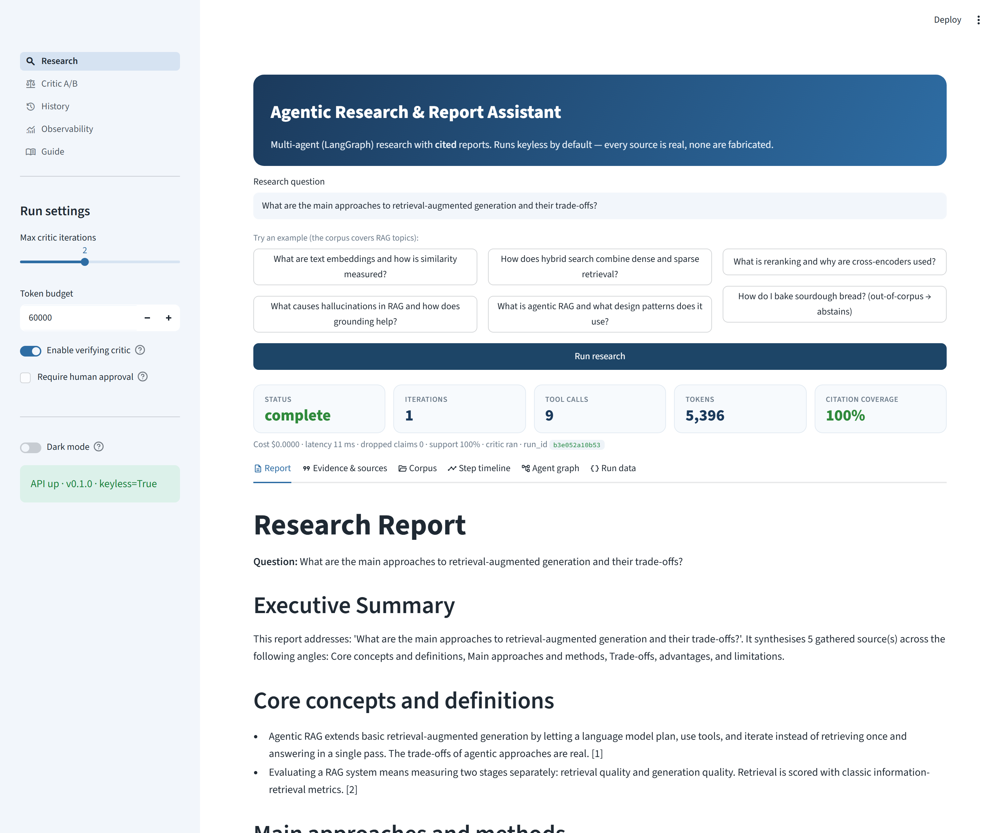
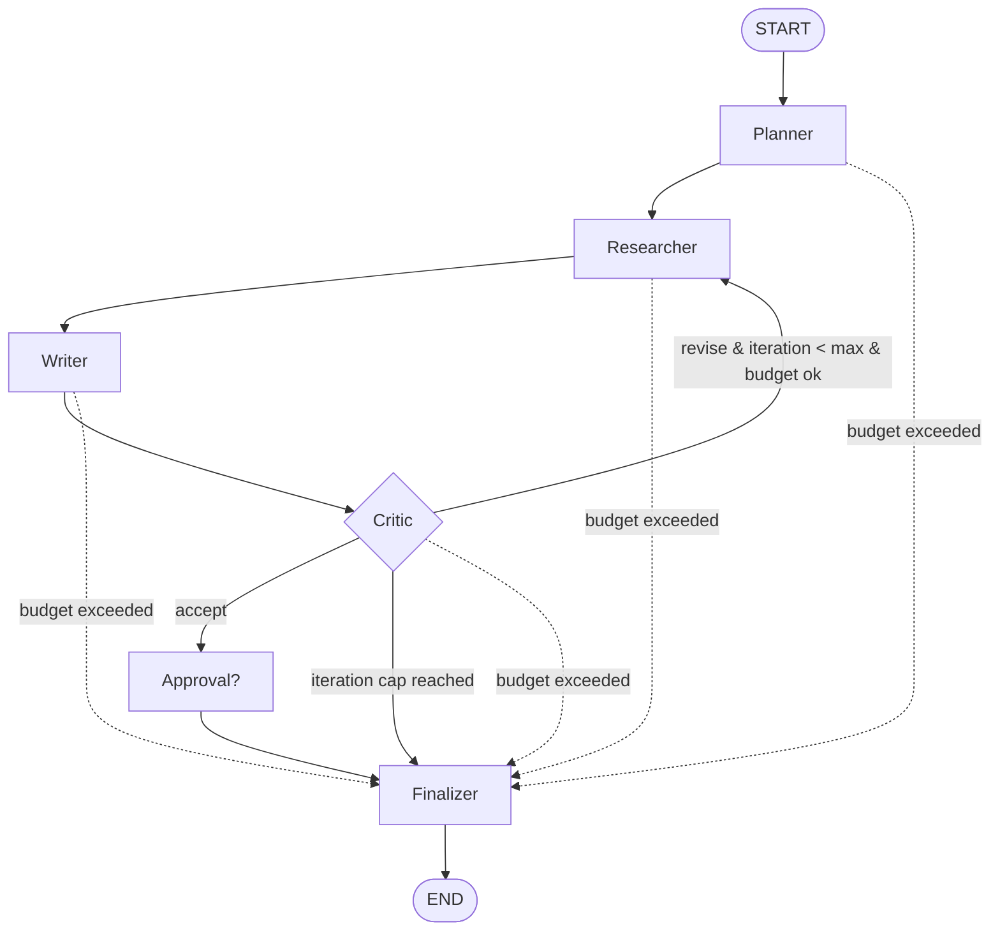
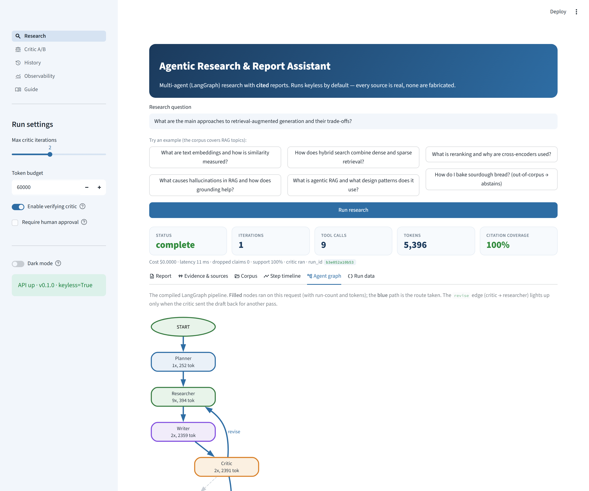
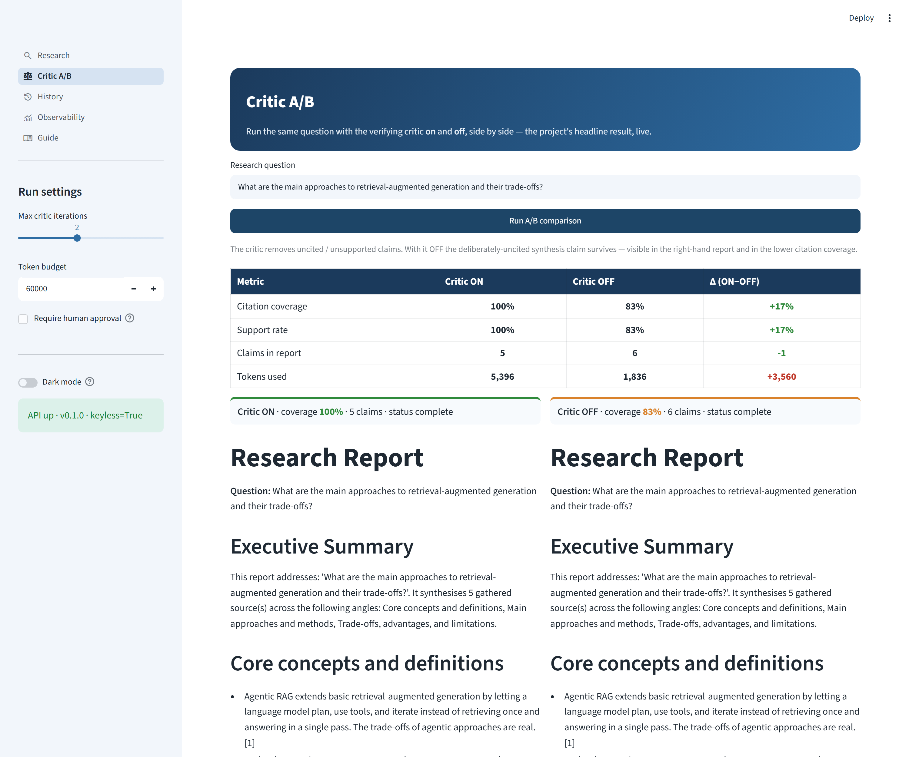
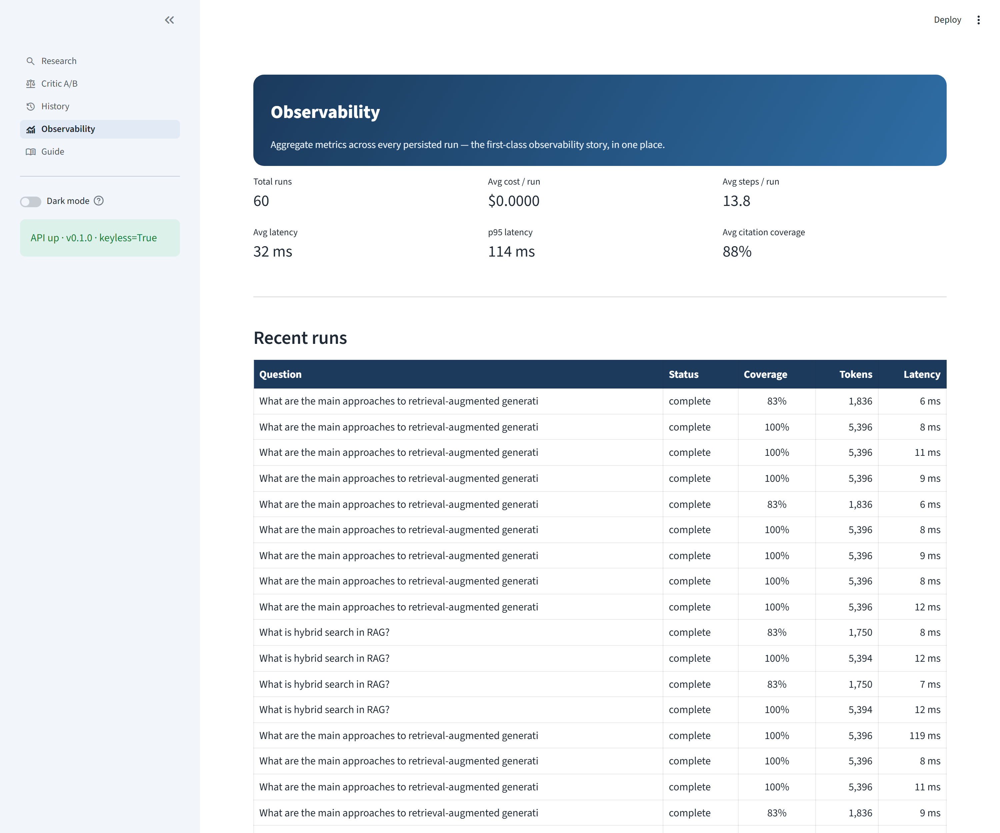
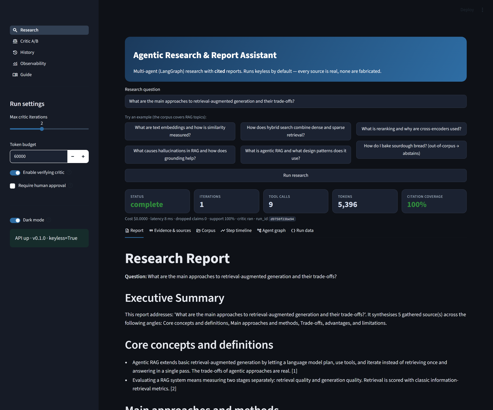

# Agentic Research & Report Assistant

[](https://www.python.org/)
[](https://github.com/Baron197/agentic-research-assistant/actions/workflows/ci.yml)
[](tests/)
[](https://github.com/astral-sh/ruff)
[](LICENSE)
[](#quickstart-keyless)

> A multi-agent **Research & Report Assistant** orchestrated with **LangGraph**: it
> plans research, gathers evidence with tools, drafts a structured report, and a
> **critic verifies every claim against a cited source** — looping back to re-draft
> (minus the rejected claims, plus any facet not yet researched) when a claim is
> unsupported. It runs **fully keyless** (deterministic fake providers, zero cost)
> and it is **structurally impossible** for the final report to cite a source that
> was not actually gathered.



## What this demonstrates

- **LangGraph orchestration** — a typed `StateGraph` of cooperating agents with explicit conditional edges, a revise loop, and a budget guard on every edge.
- **Multi-agent roles** — Planner → Researcher → Writer → Critic → Finalizer, each a small, testable pure function of `(state, ctx)`.
- **Tool use behind interfaces** — `search` and `fetch` each sit behind a `typing.Protocol` with a real and a deterministic fake implementation, chosen by a factory from typed config (Strategy pattern).
- **A no-fabricated-sources guarantee** — `enforce_citations` strips every citation to an ungathered id and drops any claim left with no valid support; proven by a dedicated test.
- **Guardrails** — schema-validated structured output (validate-and-retry), a hard `max_iterations` cap, and a token/cost budget that ends a run cleanly as `partial`.
- **Evaluation wired into CI as a gate** — real metrics (no fabricated numbers), an A/B that proves the critic loop improves quality, and a `--min-citation-coverage` gate that fails the build on regression.
- **First-class observability** — every run records an ordered trace of steps with tokens, USD cost, and latency; `/metrics` aggregates runs with a nearest-rank p95.
- **Keyless mode** — `make test`, `make eval`, and the API all work with **no API key**; real mode (OpenAI + a real search provider) is one env var away.
- **DSPy track (optional)** — the LLM reasoning steps can be swapped for declarative DSPy modules whose prompts are **auto-optimized** against the project's own grounding metric ("programming, not prompting"); import-guarded and off by default.

## Example run (keyless, offline)

```bash
make run Q="What are the main approaches to retrieval-augmented generation and their trade-offs?"
```

```text
## Core concepts and definitions
- Agentic RAG extends basic retrieval-augmented generation by letting a language
  model plan, use tools, and iterate instead of retrieving once... [1]
- Evaluating a RAG system means measuring two stages separately: retrieval
  quality and generation quality... [2]
...
## Sources
1. Agentic RAG and Multi-Agent Patterns — local://agentic-rag.md
2. Evaluating Retrieval-Augmented Generation — local://rag-evaluation.md
3. Chunking Strategies for Retrieval — local://chunking.md
4. Text Embeddings — local://embeddings.md
5. Prompt Engineering for Grounded Generation — local://prompt-engineering.md

run_id=… status=complete iterations=1 tool_calls=9 tokens=5396 usd=$0.0000 latency=9.1ms citation_coverage=100%
```

Every `[n]` maps to a source that was actually gathered. Ask an off-topic question
(*"How do I bake sourdough bread?"*) and the assistant **abstains** rather than
inventing facts.

## The agent graph



- **Planner** decomposes the question into focused sub-questions + search queries.
- **Researcher** runs `search` then `fetch` per sub-question, extracts evidence snippets with stable ids, and is budget-aware.
- **Writer** synthesises evidence into a structured report, citing **only** gathered evidence ids.
- **Critic** checks each claim against its cited evidence; on `revise` it drops unsupported claims and loops back — the researcher covers any facet not yet attempted and the writer re-drafts without the rejected claims (bounded by `max_iterations`).
- **Finalizer** applies the citation guarantee, numbers the sources, and sets `complete` / `partial`.

## Quickstart (keyless)

Requires Python 3.11+.

```bash
pip install -r requirements.txt

make test                 # deterministic, keyless -> all green
make lint                 # ruff -> clean
make eval                 # prints citation_coverage, source_validity, etc.
make eval-compare         # critic ON vs OFF -> positive delta
make run Q="What are the trade-offs of different RAG retrieval methods?"

make api                  # FastAPI on http://localhost:8000  (/docs for Swagger)
make ui                   # Streamlit UI (expects the API running)
```

> **No `make`?** (e.g. on Windows) run the underlying commands directly, with
> `src` on the path — `pip install -r requirements.txt`, then
> `set PYTHONPATH=src` (`$env:PYTHONPATH="src"` in PowerShell) and
> `pytest -q`, `python -m eval.run_eval`, `python -m agent.runner "your question"`,
> `python -m uvicorn agent.api:app`, `python -m streamlit run ui/streamlit_app.py`.

No `.env`, no API key, no network — the assistant ships with its own seed corpus
(`data/corpus/`) and evaluation tasks (`eval/tasks.jsonl`), so everything runs
offline and deterministically.

## Real mode & using it for your own work

The keyless demo runs on fakes, but the **same pipeline does real research** — two
independent switches you can use separately or together.

### Research the live web

Copy `.env.example` to `.env` (or edit the `.env` in the repo root) and flip the
providers, then add two keys:

```bash
LLM_PROVIDER=openai      OPENAI_API_KEY=sk-...       # https://platform.openai.com
SEARCH_PROVIDER=web      SEARCH_API_KEY=tvly-...     # https://app.tavily.com (free tier)
FETCH_PROVIDER=http
```

Then install the real extras (import-guarded, so the keyless path never needs them):

```bash
pip install openai tavily-python trafilatura        # trafilatura = cleaner article text
```

Cost is low — `gpt-4o-mini` is a fraction of a cent per run and Tavily has a free
tier. Keep real mode **local** (or on a private host); never put your keys on the
public demo.

### Research your own documents (work mode)

Point `CORPUS_DIR` at a folder of **your own notes** and the pipeline researches
them instead of the bundled corpus — with the same cited-report, no-fabricated-
sources guarantees:

```bash
CORPUS_DIR=C:/Users/you/research-docs               # your own .md / .txt / .pdf files
```

- Works **keyless** (retrieval + citations); add an OpenAI key for a properly
  synthesised narrative instead of the rule-based draft.
- Supported formats: Markdown, plain text, and **PDF** (`pip install pypdfium2`;
  text-only, so scanned/image PDFs are skipped — no OCR).
- Combine both switches to research the web **and** your own docs, or use either alone.

## The UI

A polished, **multi-page Streamlit** front-end (`ui/streamlit_app.py`) sits over the
API as a strict thin client (no business logic — every page only calls the API and
renders the response), with **light & dark themes** and clean monochrome Material
icons. When no API is reachable it transparently falls back to an **embedded
in-process backend** (same functions, called directly), so the whole UI can also
deploy as a **single self-contained app** — see [Deploy a demo](#deploy-a-demo-free).
Five pages (native `st.navigation`, shared state across pages):

- **Research** — ask a question (or pick an example chip); read the cited report in
  six tabs: *Report* (+ Markdown/JSON download), *Evidence & sources* (each gathered
  passage, and exactly which claim cites it), *Corpus* (which docs were used vs not
  retrieved), *Step timeline* (a colour-coded per-node trace), *Agent graph*, and
  *Run data*.
- **Critic A/B** — one click runs the same question with the critic **ON and OFF** and
  shows the citation-coverage / support delta side by side — the headline result, live.
- **History** — a browsable table of past runs; reopen any into all six tabs.
- **Observability** — the aggregate dashboard (total runs, avg cost, avg/p95 latency,
  avg coverage) fed by `GET /metrics`.
- **Guide** — an in-app, tabbed explainer of the app and every metric.

Headline touches: **colour-coded metric cards** (status + coverage go green / amber /
red), and the **Agent graph** tab renders the compiled LangGraph pipeline with *this
run's* executed path highlighted — the `revise` edge lights up only when the critic
looped back.

| | |
|:---:|:---:|
|  |  |
| **Agent graph** — this run's path in blue, revise loop lit up | **Critic A/B** — critic ON vs OFF, +0.17 coverage & support |
|  |  |
| **Observability** — aggregate metrics across every run | **Dark mode** — a sidebar toggle flips the whole app |

More screenshots (History, Guide) in [`docs/screenshots/`](docs/screenshots).

```bash
make api    # start the API on :8000 first
make ui     # then the UI on :8501 (set API_URL to point elsewhere)
```

## Docker

```bash
docker compose up --build api          # serves the keyless API on :8000
# optional UI:
docker compose up --build ui           # Streamlit on :8501, talks to the api service
```

## Deploy a demo (free)

The app is a natural fit for a cloud free tier — keyless, no database or keys.
Step-by-step instructions for four free paths are in [**DEPLOYMENT.md**](DEPLOYMENT.md):

- **Streamlit Community Cloud** — **easiest**: point it at this repo, main file
  `ui/streamlit_app.py`, click Deploy. No Docker, no CLI, no card — the UI runs the
  pipeline in-process (embedded backend), so it's one self-contained app.
- **GCP Cloud Run** — a public link with a real separate API that scales to **$0 when idle**.
- **Oracle Ampere A1** — free **forever** for the full API + UI stack.
- Guidance for the **GCP $300 free trial**, plus cost guardrails to stay at exactly $0.

## Results (keyless)

All numbers below are **recomputed from real runs** by `make eval` — none are
hand-written. They validate **structure and plumbing** on the deterministic fake
path; the one metric that needs a real model (`faithfulness`, LLM-as-judge) is
import-guarded and reported as `n/a` in keyless mode.

| Metric (keyless) | Value | What it checks |
|---|---|---|
| `citation_coverage` | **1.00** | % of claims carrying ≥1 citation |
| `source_validity` | **1.00** | % of citations whose id was actually gathered (the guarantee) |
| `support_rate` | **1.00** | % of claims whose cited evidence supports them |
| `point_coverage` | **0.90** | % of expected key facts present (keyword proxy) |
| `abstention_accuracy` | **1.00** | abstains correctly on out-of-corpus questions |
| `avg_tool_calls` | 8.9 | search + fetch calls per run |
| `avg_tokens` | ~5,340 | deterministic fake-token estimate |
| `avg_steps` | 14.9 | trace spans per run |
| `avg_latency_ms` | ~10 (machine-dep.) | offline, in-process |
| `faithfulness` | n/a | requires a real model + judge |

### Critic A/B (the headline result)

Running the critic ON vs OFF over the in-corpus tasks (`make eval-compare`):

| Metric | Critic ON | Critic OFF | Δ |
|---|---|---|---|
| `citation_coverage` | **1.00** | 0.83 | **+0.17** |
| `support_rate` | **1.00** | 0.83 | **+0.17** |

With the critic OFF, deliberately-unsupported (uncited) claims survive into the
final report; with it ON they are caught and removed. `source_validity` stays
**1.0 in both** because `enforce_citations` is an always-on hard guarantee,
independent of the critic.

## How to review this repo

A suggested reading order for an AI-engineering reviewer:

1. **`src/agent/schemas.py`** — the typed data contracts; read these first.
2. **`src/agent/graph.py`** — the LangGraph wiring, conditional edges, budget guard, finalizer.
3. **`src/agent/agents/`** — the four agents (`planner`, `researcher`, `writer`, `critic`).
4. **`src/agent/guardrails.py`** — `enforce_citations` (the no-fabricated-sources guarantee) + validate/retry.
5. **`src/agent/llm.py`** — the `LLM` Protocol, the rule-based `FakeLLM`, and the lazy `OpenAILLM`.
6. **`eval/run_eval.py`** — the metrics, the critic A/B, and the CI gate.
7. **`tests/`** — start with `test_guardrails.py::test_enforce_citations_drops_fabricated_source`.
8. **`ARCHITECTURE.md`** — the architecture deep dive.
9. **`STUDY_GUIDE.pdf`** — a plain-English, illustrated walkthrough of the whole project.

> "Show me the test that guarantees no fabricated sources":
> `tests/test_guardrails.py::test_enforce_citations_drops_fabricated_source` and
> `::test_full_run_never_cites_ungathered_source`.

## Project structure

```
src/agent/
  config.py          typed settings (pydantic-settings); defaults = fake/offline
  context.py         AgentContext: the injected dependency bundle (providers, tracer, settings)
  schemas.py         SubQuestion, ResearchPlan, Evidence, Report, Citation, Critique, Budget, Step
  llm.py             LLM protocol + FakeLLM (rule-based per role) + OpenAILLM (lazy)
  textutil.py        deterministic tokenisation / overlap / snippet helpers
  cache.py           thread-safe LRU + caching tool wrappers
  tools/
    search.py        SearchTool protocol + FakeSearch (corpus) + OpenWebSearch
    fetch.py         FetchTool protocol + FakeFetch (local://) + HttpFetch
  agents/
    planner.py  researcher.py  writer.py  critic.py
  guardrails.py      enforce_citations, validate/retry, budget + input + iteration caps
  graph.py           the LangGraph StateGraph (nodes + conditional edges)
  observability.py   Step/Tracer, cost table, thread-safe persistence, aggregate (p95)
  runner.py          run(question, ...) -> RunResult (used by API/UI/eval/CLI)
  api.py             FastAPI: POST /research, GET /runs, /runs/{id}, /corpus, /health, /metrics
  metrics.py         shared eval metrics (reused by eval + the DSPy optimizer)
  dspy_modules.py    OPTIONAL DSPy backend (Signatures + DSPyLLM); import-guarded
  dspy_metric.py     OPTIONAL DSPy optimization objective (reuses metrics.py)
  optimize.py        OPTIONAL `make optimize`: compile/optimize the DSPy program
ui/streamlit_app.py  multi-page thin client (Research / Critic A/B / History / Observability / Guide; light + dark)
.streamlit/config.toml  base UI theme
data/corpus/         11 seed docs (the "web" FakeSearch/FakeFetch operate over)
eval/
  tasks.jsonl        12 golden tasks (incl. 2 out-of-corpus abstention checks)
  run_eval.py        metrics + critic A/B + CI gate
tests/               deterministic, keyless end-to-end + unit tests (65; 6 exercise the optional DSPy track)
docs/screenshots/    UI screenshots used in this README
Dockerfile  docker-compose.yml  .dockerignore  Makefile  pyproject.toml  requirements.txt
.env.example  .gitattributes  .github/workflows/ci.yml
README.md  ARCHITECTURE.md  DEPLOYMENT.md  STUDY_GUIDE.pdf  DEPLOY_GUIDE.pdf  LICENSE
```

## Testing & CI

`make test` runs a fast, deterministic, keyless suite of **65 tests** (graph
end-to-end, no-fabricated-sources, the one-revise critic loop + iteration cap,
tiny-budget → `partial`, the fake tools, the LRU cache, cost/aggregation, the
provider-mix + config validation, and the API incl. the `/runs`, `/corpus`,
`enable_critic` and 422 paths). Six of those cover the **optional** DSPy backend
and are skipped unless `dspy-ai` is installed, so the default keyless install and
CI run **59 and skip 6** (all 65 run once the DSPy extra is present — still keyless,
via DSPy's `DummyLM`). CI (`.github/workflows/ci.yml`) runs
`ruff check .` → `pytest -q` → the eval gate, all keyless with no secrets.

## DSPy optimization track (optional)

The project ships an **optional, opt-in DSPy backend** that re-implements the LLM
reasoning steps (planner, writer, critic) as **declarative DSPy modules** plus a
**metric-driven optimizer** — "programming, not prompting". It is fully isolated:
the keyless default (`agent_backend=manual`) and every existing test and number are
unchanged, and `dspy-ai` is an optional dependency that is **never imported on the
keyless path**.

What it adds:

- **`src/agent/dspy_modules.py`** — typed `dspy.Signature`s (`PlanResearch`,
  `WriteReport`, `CritiqueReport`) wrapped as `dspy.ChainOfThought`, exposed as a
  `DSPyLLM` that conforms to the **same `LLM` Protocol** as the manual backend. The
  graph, the guardrails (incl. the no-fabricated-sources guarantee), and the eval
  treat it identically — only *how* the reasoning is produced changes.
- **`src/agent/dspy_metric.py`** — the optimization objective, which **reuses the
  project's own eval metric** (`agent.metrics`): grounding / source-validity first,
  then citation coverage and support.
- **`src/agent/optimize.py`** (`make optimize`) — builds train/dev `Example`s from
  the golden tasks, runs `BootstrapFewShot` (or `MIPROv2`) to **compile** the
  program against that metric, and saves the optimized program to `artifacts/`.
  (The optimizer targets the **writer and critic** — the steps that produce the
  scored report; the planner module runs un-bootstrapped, matching the scoped goal.)
- **`eval/run_eval.py --compare-backends`** — A/B the manual vs DSPy backend.

Run it (this is a **real-LLM** result, not keyless):

```bash
make dspy-install                      # pip install "dspy-ai>=3.0,<4"
export OPENAI_API_KEY=sk-...
make optimize                          # compiles + saves artifacts/dspy_program.json
AGENT_BACKEND=dspy make eval-compare-backends   # manual vs DSPy lift
```

**Honesty note.** DSPy metrics are **real-LLM** results, reported separately from
the keyless baseline; the optimizer never runs in the default CI gate. With DSPy
installed, `tests/test_dspy.py` still runs **keyless** via DSPy's `DummyLM` (no key)
and asserts the no-fabricated-sources guarantee holds for the DSPy backend too. The
headline to fill in after running `make optimize` on your key: *"DSPy optimization
raised citation_coverage / grounding from X to Y automatically."*

> Caveat: DSPy configures its LM via process-global state, so serving the API
> with `AGENT_BACKEND=dspy` under concurrency is not recommended; the keyless
> default backend is unaffected.

## Roadmap

- LangGraph `interrupt()` for true human-in-the-loop approval (currently a callback node).
- MCP server wrappers for the `search`/`fetch` tools (interfaces are already MCP-friendly).
- Parallel researcher fan-out across sub-questions.
- Streaming step events to the UI (the cost/observability dashboard is now shipped).
- LLM-as-judge faithfulness wired in for the real path (scaffolding + import guard present).

## About

- **Author:** Baron Purwa Hartono
- **GitHub:** [@Baron197](https://github.com/Baron197)

## License

[MIT](LICENSE).
